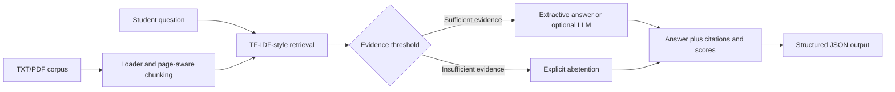

# Product Documentation

## Product name

**RAG Campus Regulations Co-pilot**

## Product purpose

The co-pilot helps students locate and verify answers in university regulation documents. It is an offline-first course prototype, not an official university decision system.

## Persona and user problem

### Primary persona: university student

- Needs to understand academic progression, conduct, grievance, research, or administrative rules.
- Faces long and distributed PDF handbooks with inconsistent terminology.
- Wants a concise answer and a source that can be checked.
- Needs the system to say when the current corpus does not contain enough evidence.

### Secondary persona: teaching or administrative staff

- Wants a transparent first-pass retrieval aid.
- Needs to inspect the evidence and reproduce the result.
- Must retain responsibility for official interpretation and communication.

## Input

The command-line application accepts:

1. A natural-language student question.
2. A data directory containing `.txt` and/or `.pdf` regulation documents.
3. An optional `--min-score` relevance threshold.
4. An optional OpenAI-compatible model configuration through environment variables.

Example:

```bash
python -m rag_copilot.cli --data data/demo ask "What is the late submission penalty?"
```

## Output

The `ask` command returns structured JSON containing:

- `answer`: extractive or optional model-generated response;
- `abstained`: whether evidence was insufficient;
- `citations`: source filename and page number;
- `retrieval`: retrieved chunks and relevance scores.

Example shape:

```json
{
  "answer": "...",
  "abstained": false,
  "citations": ["academic_regulations.txt, p. 1"],
  "retrieval": []
}
```

The `evaluate` command reports total questions, answerable questions, citation hit rate, unanswerable questions, and abstention recall.

## High-level product architecture



## Business and technical choices

- **Deterministic local retrieval:** inexpensive, inspectable, and reproducible for a classroom demo.
- **Optional LLM generation:** improves fluency when configured, but is not required for execution.
- **Citation and abstention:** prioritise auditability over always producing an answer.
- **Public bounded corpus:** avoids handling private student data in this prototype.

## Metrics targeted

1. **Citation hit rate:** whether a retrieved citation comes from the expected source file for an answerable question.
2. **Abstention recall:** whether unsupported questions are correctly rejected.
3. **Answer correctness and citation completeness:** intended for future human-rated evaluation.
4. **Retrieval relevance:** whether top-ranked chunks contain useful evidence.
5. **Reproducibility:** whether another user can run the same code and committed data.
6. **Cost and latency:** future operational metrics for an API-backed deployment.

## Metrics reached

The committed evaluation contains 50 questions across ten public PDFs:

| Metric | Current result |
|---|---:|
| Total questions | 50 |
| Answerable questions | 48 |
| Unanswerable questions | 2 |
| Citation hit rate | 91.67% |
| Abstention recall | 100% |

These results are retrieval and abstention indicators, not a human answer-quality study. The evaluation set is small and developer-authored, and two negative examples cannot establish production safety. The metrics should not be interpreted as guaranteed factual accuracy, user time savings, or institutional policy compliance.

## Scope and responsible use

The prototype does not register courses, process payments, make disciplinary decisions, or replace official communication. Users should verify deadlines, sanctions, appeals, housing obligations, and other high-stakes matters with the relevant official channel. Scanned or image-only PDF pages may not be searchable because OCR is not included.

## Future product path

A next version should add a human evaluation against `Ctrl+F`, document version and freshness checks, OCR, hybrid lexical-vector retrieval, a browser interface, access controls, logging, privacy controls, and a clear escalation path to official staff.